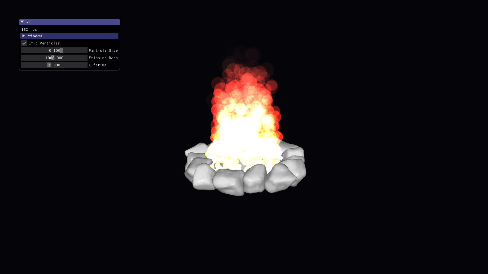

# Rapport de Projet : Simulation de Feu de Camp Volumétrique

Par Thomas POLO et Gabriel CELLIER

# Introduction

Dans le cadre de ce projet de synthèse d'image, nous avons choisi de nous concentrer sur la simulation de phénomènes naturels, et plus particulièrement sur la modélisation d'un feu de camp. Contrairement aux objets rigides classiques, le feu est un fluide gazeux, turbulent, lumineux et hautement instable. Sa nature chaotique en fait un sujet d’étude particulièrement intéressant, tant du point de vue physique que du point de vue graphique.

Notre objectif principal était de produire une simulation visuellement réaliste et performante, capable de fonctionner en temps réel (60 FPS) au sein du framework **CGP**. Pour cela, nous avons développé un moteur complet de système de particules, associé à un ensemble de shaders et d’algorithmes dédiés à la génération de turbulences, à la gestion de la couleur, et au rendu volumétrique.

Ce rapport détaille l’ensemble des solutions techniques adoptées : du choix méthodologique jusqu’à la conception du pipeline graphique, en passant par l’architecture mémoire, le modèle physique, la gestion du bruit de Perlin, et la mise en place d’une interface utilisateur avancée.



*(Figure 1 : Rendu final de notre simulation intégré dans l'environnement 3D)*

---

# 2. Choix de l'Approche Technique

Pour la modélisation d’un phénomène aussi complexe qu’un feu, plusieurs approches sont possibles. Chacune présente des avantages mais également des limites :

* **Spritesheets animés** : peu coûteux mais trop plats et limités à des angles de vue restreints.
* **Simulation de fluides volumétriques (voxels)** : approches physiquement réalistes (Navier–Stokes), mais extrêmement gourmandes et difficilement exploitables en temps réel sans GPU dédié.
* **Systèmes de particules** : flexibles, performants, adaptables, et compatibles avec un rendu riche.

Après comparaison, le système de particules s’est imposé comme le meilleur compromis. Il permet :

* un contrôle précis du comportement des flammes,
* une intégration simple au moteur CGP,
* un rendu convaincant si l’éclairage, la turbulence et le blending sont bien maîtrisés.

---

# 3. Architecture Logicielle et Gestion Mémoire

Nous avons conçu une architecture légère et modulaire centrée autour de la classe `fire_scene`, responsable de la gestion des particules, de la mise à jour physique et du rendu.

## 3.1 Structure de Données Optimisée

La structure `particle` est volontairement minimale, ce qui permet :

* un transfert rapide vers le GPU,
* une mise à jour efficace,
* une bonne localité mémoire.

```cpp
struct particle {
    cgp::vec3 position;     // Position dans l'espace
    cgp::vec3 velocity;     // Vecteur vitesse
    float life;            // Temps de vie restant
    float max_life;        // Durée de vie initiale
    float size;            // Taille pour le rendu
    float rotation_offset; // Rotation aléatoire pour les variations visuelles
};
```

## 3.2 Gestion Dynamique du Pool de Particules

Pour maintenir des performances constantes malgré un nombre élevé de particules, plusieurs optimisations ont été mises en œuvre :

* **Pré-allocation stratégique** via `reserve(10000)` pour éviter les multiples réallocations sur la durée de l'exécution.
* **Nettoyage en une passe** via `std::remove_if`, permettant de supprimer efficacement toutes les particules arrivées en fin de vie.
* **Réutilisation de mémoire** : au lieu de détruire et recréer, la simulation recycle continuellement les particules lorsque cela est possible.

---

# 4. Implémentation du Modèle Physique

Nous avons développé un modèle basé sur plusieurs forces fondamentales, combinées de façon additive puis intégrées par un schéma d’Euler explicite. Notre but n’était pas d’obtenir une simulation physiquement exacte, mais plutôt un mouvement crédible, harmonieux et esthétique.

## 4.1 Émission Contrôlée

Les particules sont émises depuis un disque représentant le foyer. Pour éviter une concentration artificielle au centre, nous utilisons une distribution radiale corrigée (`r = sqrt(random)`), assurant une densité homogène sur toute la surface.

Un système d’accumulateur temporel assure un débit d’émission constant, indépendamment du framerate, garantissant ainsi la reproductibilité du feu.

## 4.2 Forces et Comportements

La simulation comporte trois grandes catégories de forces :

### A. Convection Thermique (Buoyancy)

Force verticale imitant la montée de l’air chaud :

```cpp
p.velocity.y += 2.0f * dt;
```

### B. Force de Confinement (Centering Force)

Cette force ramène progressivement les particules vers l’axe central du feu :

* elle reproduit l'appel d’air caractéristique,
* elle donne au feu sa forme pyramidale.

### C. Turbulence Procédurale (Bruit de Perlin 3D)

La turbulence est essentielle pour obtenir un feu réaliste. Nous utilisons du bruit de Perlin 3D modulé par la position et le temps :

```cpp
float n_x = noise_perlin({ p.position.x, p.position.y - time, time });
p.velocity += turbulence * n_x;
```

Un offset temporel dépendant de la hauteur crée une impression de volutes et de spirales montant le long de la flamme.

*(Figure 2 : Visualisation des trajectoires : volutes générées par le bruit)*

---

# 5. Rendu Visuel Avancé

## 5.1 Billboarding (Orientation Automatique vers la Caméra)

Bien que nous ayons finalement choisi d'utiliser des sphères déformées pour donner du volume aux particules, l'approche classique du **billboarding** a joué un rôle important dans le développement et les tests préliminaires du système.

Le billboarding consiste à orienter dynamiquement un quad (plan 2D) de sorte qu’il fasse toujours face à la caméra. Cette technique est couramment utilisée dans les moteurs de jeux pour représenter des effets visuels tels que :

* flammes,
* fumée,
* étincelles,
* particules lumineuses,
* feuillage lointain.

Dans notre projet, nous avons implémenté une version complète du billboarding avant de la remplacer par des primitives 3D. Cette implémentation reste activable dans le mode "debug" pour visualiser de manière plus simple le comportement des particules.

### Fonctionnement Technique

Le principe est d’aligner le quad sur le vecteur de vue :

1. On calcule la direction caméra → particule.
2. On construit une base orthonormée adaptée (vecteurs right/up).
3. On applique cette orientation au quad lors du vertex shading.

Cela garantit que le sprite :

* reste visible sous n’importe quel angle,
* conserve une apparence cohérente,
* évite les distorsions lorsqu’on se déplace autour du feu.

### Avantages et Limites

**Avantages :**

* Très léger computationnellement.
* Idéal pour un très grand nombre de particules.
* Rendu lisible et propre, surtout pour la fumée ou les effets lumineux.

**Limites :**

* Apparence moins volumétrique.
* Effet "plat" perceptible lorsque la caméra tourne rapidement.
* Nécessite une gestion fine de la texture (sprites animés, alpha premultiplied, etc.).

Bien que le billboarding n’ait pas été retenu comme solution de rendu final pour les flammes, il constitue un élément fondamental de tout moteur de particules moderne et a facilité la phase de prototypage de notre feu.

## 5.2 Utilisation de Primitives 3D

Nous avons opté pour des sphères scalées plutôt que des quads 2D. Ce choix apporte :

* une meilleure cohérence visuelle en rotation,
* un volume crédible,
* une intégration harmonieuse dans la scène 3D.

## 5.3 Algorithme de Couleur (Gradient Thermique)

Nous avons implémenté un gradient thermique multi-étages reflétant les différentes phases de combustion :

* **blanc / jaune très clair** : noyau extrêmement chaud,
* **orange vif** : corps principal de la flamme,
* **rouge sombre** : zones de refroidissement,
* **gris / translucide** : transitions vers la fumée.

La couleur d’une particule dépend directement de son ratio `life / max_life`, assurant un dégradé fluide et esthétique.

## 5.4 Transparence et Blending

L’effet d’incandescence est obtenu grâce au **blending additif**, très utilisé dans les moteurs de jeux vidéo :

* les zones denses s’additionnent lumineusement,
* cela évite les contours artificiels,
* permet de simuler une lumière interne sans HDR.

---

# 6. Interface Utilisateur (GUI)

Nous avons intégré une interface complète grâce à **ImGui**, permettant de :

* ajuster la densité d’émission,
* modifier la taille des particules,
* contrôler la turbulence,
* activer un mode "debug" pour visualiser la géométrie brute.

Cette interface a joué un rôle essentiel pour le réglage fin des valeurs physiques et pour l’obtention d’un résultat visuel harmonieux.

*(Figure 3 : interface pour le contrôle dynamique de la simulation)*

---

# 7. Conclusion

Ce projet nous a permis de mettre en œuvre une chaîne graphique complète allant de la gestion bas niveau des données jusqu’au rendu avancé des flammes. Le système de particules couplé au bruit de Perlin s’est avéré être une solution extrêmement efficace pour modéliser un feu crédible et dynamique.

Nous avons atteint notre objectif : produire un feu volumétrique, animé par des turbulences procédurales complexes, s’exécutant à **60 FPS** tout en restant visuellement convaincant.

Ce travail ouvre également la voie à plusieurs extensions : ajout de fumée volumétrique, interaction avec des objets 3D, éclairage dynamique, ou encore simulation GPU pour un rendu encore plus riche.
